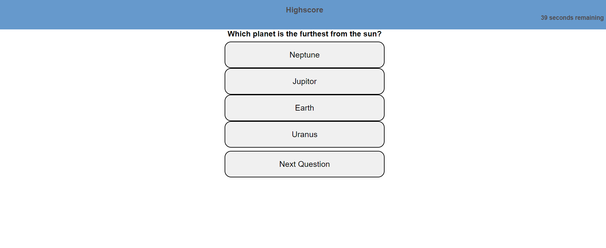

# quiz

## Description
This project was to create a quiz that takes the correct answers and giving the user a score. It then allows the user to enter their Initials to save their score in local storage. This project was made primarily with JavaScript to make major changes to the webpage. HTML and CSS were used for basic styling and formatting.

## Screenshots

## Link to deployed application

[Quiz](https://amassey42.github.io/quiz/)